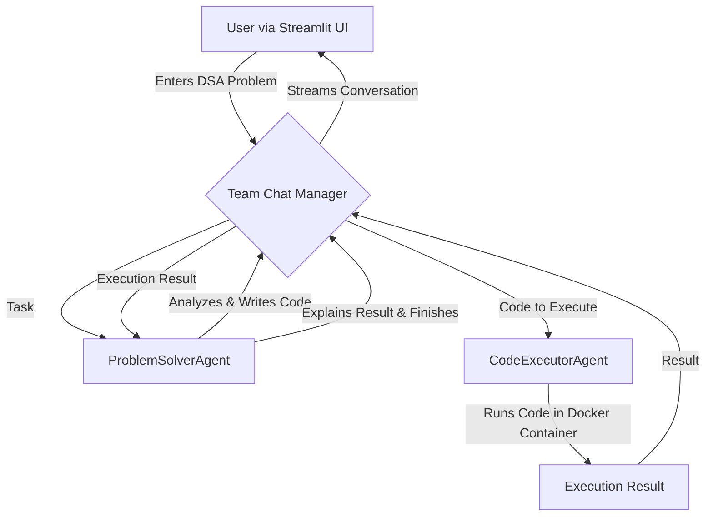

# 🧠 AlgoGenie: The AI-Powered DSA Solver

AlgoGenie is an advanced application that leverages a multi-agent AI system built with Microsoft's AutoGen to solve complex Data Structures and Algorithms (DSA) problems. It's not just a code generator; it's a conversational AI team that plans, codes, executes, and explains solutions, simulating a collaborative problem-solving process.

This project is designed to run in a containerized environment and is deployed on **Render**.


---

## ## ✨ Features

* **Conversational AI Interface**: A user-friendly web interface built with Streamlit.
* **Multi-Agent System**: Utilizes two specialized AI agents:
    * **`ProblemSolverAgent`**: Analyzes the problem, devises a plan, and writes Python code.
    * **`CodeExecutorAgent`**: Securely executes the generated code inside a Docker container.
* **Secure Code Execution**: All code is run in an isolated Docker environment to ensure safety.
* **Step-by-Step Solutions**: The agents work together to generate, test, and explain the code for any given DSA problem.

---

## ## 🛠️ Tech Stack

* **Backend**: Python, Microsoft AutoGen
* **Frontend**: Streamlit
* **Code Execution**: Docker
* **Deployment**: Render

---

## ## 🏗️ System Architecture

The application operates through a conversation between two primary AI agents managed by a team chat.



---

## ## 🚀 Getting Started: Running Locally

Follow these steps to set up and run AlgoGenie on your local machine.

### ### Prerequisites

Before you begin, ensure you have the following installed:
* [Python 3.10+](https://www.python.org/downloads/)
* [Docker Desktop](https://www.docker.com/products/docker-desktop/) - **Must be installed and running.**
* [Git](https://git-scm.com/downloads)

### ### 1. Clone the Repository

Open your terminal and clone the project repository:
```bash
git clone [https://github.com/your-username/algogenie-dsa-solver.git](https://github.com/your-username/algogenie-dsa-solver.git)
cd algogenie-dsa-solver
```

### ### 2. Set Up Environment Variables

The application requires an API key for the language model.

1.  Create a file named `.env` in the root of the project directory.
2.  Add your API key to this file. It should look like this:

    ```
    GOOGLE_API_KEY="YOUR_GEMINI_API_KEY_HERE"
    ```

### ### 3. Create a Virtual Environment and Install Dependencies

It's highly recommended to use a Python virtual environment.

```bash
# Create a virtual environment
python3 -m venv venv

# Activate it (on macOS/Linux)
source venv/bin/activate

# On Windows
# venv\Scripts\activate

# Install the required packages
pip install -r requirements.txt
```

### ### 4. Run the Application

With Docker Desktop running in the background, you can now start the Streamlit application.

```bash
streamlit run app.py
```

Your application should now be running! Open your web browser and navigate to **`http://localhost:8501`**.

---

## ## 🖥️ Usage

1.  Open the application in your browser.
2.  Enter a DSA problem statement into the text box (e.g., "Write a Python function to find the depth of a binary tree").
3.  Click the **"Run"** button.
4.  Watch as the AI agents collaborate to provide a plan, code, and execution results in real-time.

---

## ## 📄 License

This project is licensed under the MIT License. See the `LICENSE` file for details.
